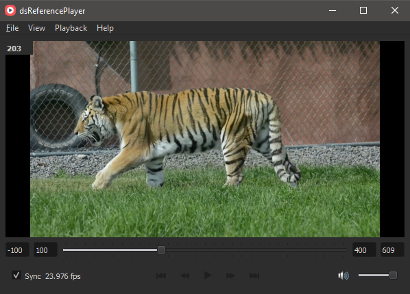
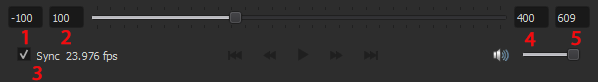

# dsReferencePlayer
 Reference player with sync to Maya
 


## Key features:
- Sync current frame to Maya's timeslider via command port.
- Save/load playback presets.

## How to use:
1. If you do not already have one, create a **userSetup.py** file inside **maya/scripts** directory and add the following line to it:
```python
maya.cmds.commandPort(name='127.0.0.1:7221', stp='python', echoOutput=True)
```
2. Launch **dsReferencePlayer.exe**. If connection to maya was not successfull - player will notify you and suggest changing command port.
3. Open video file using **File>Open**. It will take some time to process video depending on number of frames in it.
4. From menubar select **Playback > Match player playback options** to match current video framerate and animation length inside Maya. 
5. Tick **Sync** check box to enable synchronization of Maya's timeslider.

## Playback controls breakdown

1. Playback offset
2. Playback start
3. Sync toggle
4. Playback end
5. Video total length (not editable)

*Start position of Maya's playback slider: Playback start + Playback offset.*\
*End position of Maya's playback slider: Playback end - Playback start.*

## Troubleshooting
- No video preview - possible problem with codecs. This player uses openCv2 library, try installing K-Lite Codec from: https://codecguide.com/download_k-lite_codec_pack_basic.htm
- Unexpected behaviour: Latest caught exeptions log file can be found at **Users/*yourUserName*/AppData/Local/dsReferencePlayer**. Submit it as attachment for new issue here: https://github.com/S0nic014/dsReferencePlayer/issues
